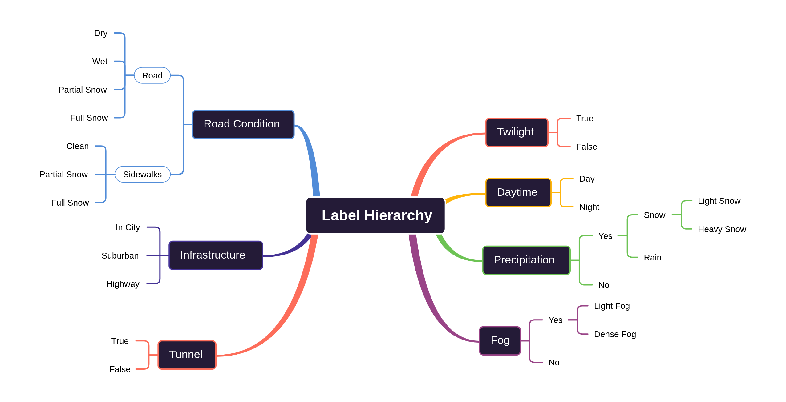
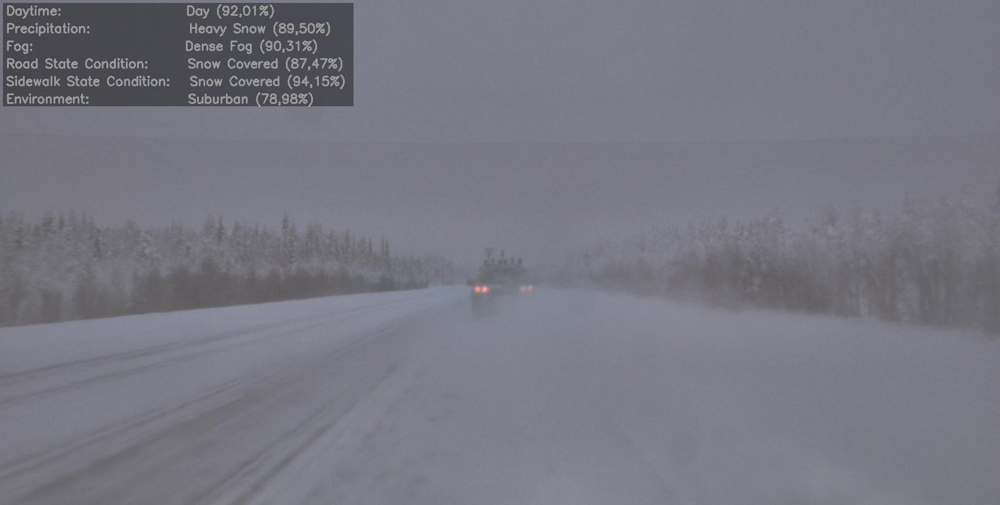
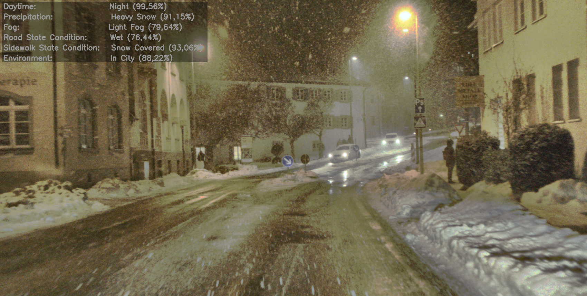
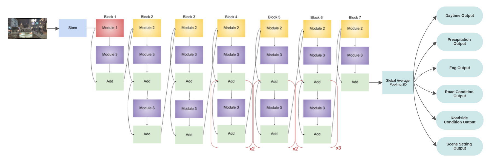

Adverse Weather Conditions Detection
====================================
This project proposes a novel deep learning framework to categorize weather conditions, road conditions and environment 
understanding for autonomous vehicles in adverse or regular cases. Weather significantly impacts driver behaviour,
vehicle performance, surface friction, and road-way infrastructure, raising the chance of an accident.
The contributions of this project are as follows. First, a model capable of accurately identifying weather conditions,
road and surrounding environment conditions was constructed. Specifically, using the EfficientNet, it was feasible 
to create an architecture that can be efficiently applied in real-time settings to provide choices for autonomous
cars with rapid, precise detection capacity. This network’s output comprises six categories: 

- Daytime;
- Precipitation;
- Fog;
- Road condition;
- Roadside condition;
- Scene-setting. 

Then, a dataset containing 12997 images collected in Northern Europe for a total of 10,000km travelled was suitably 
relabeled to account for the categories described above, allowing the possibility of simultaneously classifying
the external weather conditions, the road and the surrounding environment through a single architecture.

##### Diagram of new label hierarchy.



Download the SeeingThroughFog dataset from the [DENSE dataset webpage](https://www.uni-ulm.de/en/in/driveu/projects/dense-datasets).
Please see [paper](https://www.cs.princeton.edu/~fheide/AdverseWeatherFusion/figures/AdverseWeatherFusion.pdf) for more information.

##### Prediction of two images belonging to the test set in which the predicted classes and the confidence levels are displayed.




## Getting Started

Clone the benchmark code.
```
$ git clone https://github.com/marcointrovigne/AdverseWeatherDetection
$ cd adverse_weather_detection
```

For running the evaluation and visualization code you need Python with the following packages:
- tensorflow
- numpy
- cv2
- argparse
- wandb
- pandas
- matplotlib

We provide a conda environment to run our code.
```
$ conda env create -f environment.yml
```

Activate the conda environment.
```
$ conda activate WeatherClassificattion
```

## Instructions

For training
```
$ python main.py --root_path [path to dataset] --training --architecture [select architecture: single, concatenated, vit]
--height [int value] --width [int value]
```

For prediction
```
$ python main.py --root_path [absolute path to dataset] --prediction --architecture [select architecture: single, concatenated, vit]
--height [int value] --width [int value] --weight_path [absolute path to weights of the model selected]
```

## Models overview

### EfficientNet

A new framework based on a single backbone using EfficientNet-B2 architecture and six different FC-layers is introduced to
recognize weather and visual conditions from street-level images to address this new multi-output classification.
Thanks to the usage of this framework, with an order of magnitude of a few parameters, the computational cost is dramatically
reduced. Consequently, the proposed framework can be effectively implemented in real-time environments to provide decisions 
on demand for autonomous vehicles with quick, precise detection capacity.
Please see EfficientNet [paper](https://arxiv.org/pdf/1905.11946.pdf) for more information.

##### Overview of the final architecture with one single EfficientNet backbone and multi-output.



##### Overall network specifications

| # of Parameters | Training Time | Prediction Time |
|-----------------|---------------|-----------------|
| 9.9M            | 6h 20m        | 49ms            |

##### Weighted average results for the model described.

| Category           | Accuracy | Precision | Recall | F1-Score | AUPRC |
|--------------------|----------|-----------|--------|----------|-------|
| Daytime            | 0.99     | 0.99      | 0.99   | 0.99     | 0.99  |
| Precipitation      | 0.89     | 0.88      | 0.89   | 0.88     | 0.89  |
| Fog                | 0.93     | 0.93      | 0.93   | 0.93     | 0.97  |
| Road Condition     | 0.84     | 0.84      | 0.84   | 0.84     | 0.93  |
| Roadside Condition | 0.85     | 0.83      | 0.85   | 0.83     | 0.89  |
| Scene Setting      | 0.92     | 0.92      | 0.92   | 0.92     | 0.95  |

### Reference

If you find this work useful, please cite Biejelic et al. [paper](https://openaccess.thecvf.com/content_CVPR_2020/html/Bijelic_Seeing_Through_Fog_Without_Seeing_Fog_Deep_Multimodal_Sensor_Fusion_CVPR_2020_paper.html)
```
@InProceedings{Bijelic_2020_STF,
    author={Bijelic, Mario and Gruber, Tobias and Mannan, Fahim and Kraus, Florian and Ritter, Werner and Dietmayer, Klaus and Heide, Felix},
    title={Seeing Through Fog Without Seeing Fog:
    Deep Multimodal Sensor Fusion in Unseen Adverse Weather},
    booktitle = {The IEEE Conference on Computer Vision and Pattern Recognition (CVPR)},
    month = {June},
    year = {2020}
}
```
